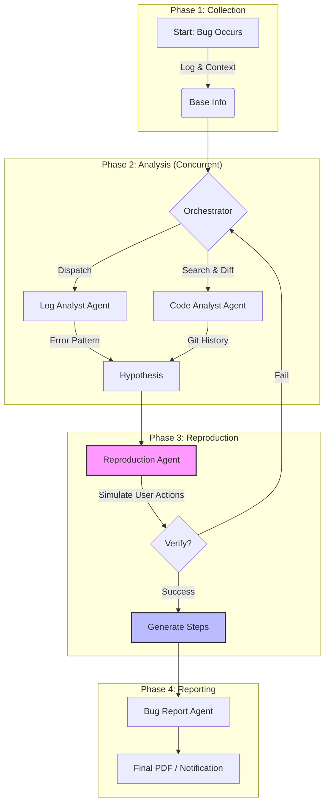

# BugSleuth: Automated Bug Analysis Agent

**BugSleuth** is an intelligent agent framework designed to automate the process of analyzing, reproducing, and reporting software bugs. It leverages LLMs to investigate issues, parsing logs, and identifying root causes.

## Features

*   **Automated Log Analysis**: Parses application logs to identify error patterns.
*   **Reproduction Steps**: attempts to deduce the steps required to reproduce a reported bug.
*   **Integrated Reporting**: Generates detailed bug reports with findings.
*   **Extensible Framework**: Designed to be integrated into custom toolchains.

## The BugSleuth Pipeline

The core value of BugSleuth is its ability to autonomously **deduce reproduction steps** from complex, noisy production environments. It transforms raw chaos into actionable reports via a structured 4-stage pipeline:



1.  **Collection**: Captures logs, screenshots, and device state.
2.  **Analysis**: Concurrently analyzes logs for error patterns and code for recent changes (Git history/Diffs) to form a hypothesis.
3.  **Reproduction (Core)**: The system attempts to simulate user actions based on the hypothesis to verify the bug. **Finding the exact reproduction steps is the key deliverable.**
4.  **Reporting**: Synthesizes all findings into a clear, actionable report for developers.

## Installation

```bash
pip install -e .
```

## Getting Started

1.  **Environment Setup**:
    Ensure you have your target project's root directory accessible.

2.  **Run the Server**:
    ```bash
    bug-sleuth-server
    ```

## Contributing

This project is open source. Contributions are welcome!
